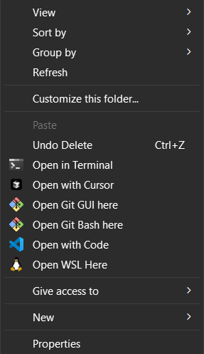

# 🖱️ Windows Explorer Context Menu Enhancement

**Supercharge your Windows File Explorer with one-click access to your favorite development tools!**

Instantly open the current folder in **WSL**, **Git Bash**, **Visual Studio Code**, or **Cursor** directly from the right-click context menu in Windows File Explorer.



---

## ✨ Features

- 🚀 **One-click productivity** – No more manual navigation or typing paths
- 🐧 **Open WSL Here** – Jump into your Linux environment instantly with proper directory mapping
- 🌳 **Open Git Bash Here** – Launch Git Bash terminal in the selected folder
- 💙 **Open with VS Code** – Launch Visual Studio Code workspace in the current directory
- 🎯 **Open with Cursor** – Open folder in Cursor AI-powered editor for enhanced coding
- 📂 **Universal compatibility** – Works everywhere:
  - Right-clicking **on any folder**
  - Right-clicking **in empty space inside folders**
  - Works with **network drives** and **mapped folders**

---

Note:The Reg File In the repository only deals with WSl And Bash , To Add More Items to the Context Menu Follow The Process Below.

## 🔧 Quick Installation

### Method 1: Automatic Registry File

1. **Copy the registry content below** into a new text file
2. **Save as** `context-menu-enhancement.reg` (ensure file type is set to "All Files")
3. **Double-click** the `.reg` file
4. **Click "Yes"** when prompted by Windows UAC
5. **Done!** Right-click anywhere in File Explorer to test

### Method 2: Manual Registry Editing

1. Press `Win + R`, type `regedit`, and press Enter
2. Navigate to the registry keys shown below
3. Manually create the entries as specified

---

## 📋 Registry Configuration

```reg
Windows Registry Editor Version 5.00

; ===============================================
; WSL (Windows Subsystem for Linux)
; ===============================================
[HKEY_CLASSES_ROOT\Directory\shell\OpenWSL]
@="Open WSL Here"
"Icon"="C:\\Windows\\System32\\wsl.exe"

[HKEY_CLASSES_ROOT\Directory\shell\OpenWSL\command]
@="C:\\Windows\\System32\\wsl.exe --cd \"%V\""

[HKEY_CLASSES_ROOT\Directory\Background\shell\OpenWSL]
@="Open WSL Here"
"Icon"="C:\\Windows\\System32\\wsl.exe"

[HKEY_CLASSES_ROOT\Directory\Background\shell\OpenWSL\command]
@="C:\\Windows\\System32\\wsl.exe --cd \"%V\""

; ===============================================
; Git Bash
; ===============================================
[HKEY_CLASSES_ROOT\Directory\shell\OpenGitBash]
@="Open Git Bash Here"
"Icon"="C:\\Program Files\\Git\\git-bash.exe"

[HKEY_CLASSES_ROOT\Directory\shell\OpenGitBash\command]
@="\"C:\\Program Files\\Git\\git-bash.exe\" --cd=\"%V\""

[HKEY_CLASSES_ROOT\Directory\Background\shell\OpenGitBash]
@="Open Git Bash Here"
"Icon"="C:\\Program Files\\Git\\git-bash.exe"

[HKEY_CLASSES_ROOT\Directory\Background\shell\OpenGitBash\command]
@="\"C:\\Program Files\\Git\\git-bash.exe\" --cd=\"%V\""

; ===============================================
; Visual Studio Code
; ===============================================
[HKEY_CLASSES_ROOT\Directory\shell\OpenWithCode]
@="Open with VS Code"
"Icon"="C:\\Users\\%USERNAME%\\AppData\\Local\\Programs\\Microsoft VS Code\\Code.exe"

[HKEY_CLASSES_ROOT\Directory\shell\OpenWithCode\command]
@="\"C:\\Users\\%USERNAME%\\AppData\\Local\\Programs\\Microsoft VS Code\\Code.exe\" \"%V\""

[HKEY_CLASSES_ROOT\Directory\Background\shell\OpenWithCode]
@="Open with VS Code"
"Icon"="C:\\Users\\%USERNAME%\\AppData\\Local\\Programs\\Microsoft VS Code\\Code.exe"

[HKEY_CLASSES_ROOT\Directory\Background\shell\OpenWithCode\command]
@="\"C:\\Users\\%USERNAME%\\AppData\\Local\\Programs\\Microsoft VS Code\\Code.exe\" \"%V\""

; ===============================================
; Cursor AI Editor
; ===============================================
[HKEY_CLASSES_ROOT\Directory\shell\OpenWithCursor]
@="Open with Cursor"
"Icon"="C:\\Users\\%USERNAME%\\AppData\\Local\\Programs\\Cursor\\Cursor.exe"

[HKEY_CLASSES_ROOT\Directory\shell\OpenWithCursor\command]
@="\"C:\\Users\\%USERNAME%\\AppData\\Local\\Programs\\Cursor\\Cursor.exe\" \"%V\""

[HKEY_CLASSES_ROOT\Directory\Background\shell\OpenWithCursor]
@="Open with Cursor"
"Icon"="C:\\Users\\%USERNAME%\\AppData\\Local\\Programs\\Cursor\\Cursor.exe"

[HKEY_CLASSES_ROOT\Directory\Background\shell\OpenWithCursor\command]
@="\"C:\\Users\\%USERNAME%\\AppData\\Local\\Programs\\Cursor\\Cursor.exe\" \"%V\""
```

---

## ⚙️ Customization Options

### 📍 Custom Installation Paths
**Update these paths if your applications are installed elsewhere:**

| Application | Default Path | Alternative Paths |
|------------|--------------|-------------------|
| **Git Bash** | `C:\Program Files\Git\git-bash.exe` | `C:\Program Files (x86)\Git\git-bash.exe` |
| **VS Code** | `%USERPROFILE%\AppData\Local\Programs\Microsoft VS Code\Code.exe` | `C:\Program Files\Microsoft VS Code\Code.exe` |
| **Cursor** | `%USERPROFILE%\AppData\Local\Programs\Cursor\Cursor.exe` | Check your installation directory |

### 🔍 Find Your Installation Paths
```cmd
# Find VS Code installation
where code

# Find Git installation  
where git

# Check if WSL is available
wsl --version
```

---

## 🗑️ Uninstallation

To remove all context menu entries, save and run this registry file:

```reg
Windows Registry Editor Version 5.00

; Remove WSL entries
[-HKEY_CLASSES_ROOT\Directory\shell\OpenWSL]
[-HKEY_CLASSES_ROOT\Directory\Background\shell\OpenWSL]

; Remove Git Bash entries  
[-HKEY_CLASSES_ROOT\Directory\shell\OpenGitBash]
[-HKEY_CLASSES_ROOT\Directory\Background\shell\OpenGitBash]

; Remove VS Code entries
[-HKEY_CLASSES_ROOT\Directory\shell\OpenWithCode]
[-HKEY_CLASSES_ROOT\Directory\Background\shell\OpenWithCode]

; Remove Cursor entries
[-HKEY_CLASSES_ROOT\Directory\shell\OpenWithCursor]
[-HKEY_CLASSES_ROOT\Directory\Background\shell\OpenWithCursor]
```

---

## 🚨 Troubleshooting

### Common Issues and Solutions

| Problem | Solution |
|---------|----------|
| **Menu items don't appear** | Restart Windows Explorer: `Ctrl+Shift+Esc` → End `explorer.exe` → `File` → `Run new task` → `explorer.exe` |
| **"Application not found" error** | Verify installation paths in the registry entries match your actual installation |
| **WSL option doesn't work** | Enable WSL: `wsl --install` in elevated PowerShell |
| **Permission denied** | Run the `.reg` file as Administrator |

### 🔧 Verify Installation Paths
```powershell
# PowerShell script to check if applications exist
$apps = @{
    "VS Code" = "$env:USERPROFILE\AppData\Local\Programs\Microsoft VS Code\Code.exe"
    "Cursor" = "$env:USERPROFILE\AppData\Local\Programs\Cursor\Cursor.exe"  
    "Git Bash" = "C:\Program Files\Git\git-bash.exe"
    "WSL" = "C:\Windows\System32\wsl.exe"
}

foreach ($app in $apps.GetEnumerator()) {
    if (Test-Path $app.Value) {
        Write-Host "✅ $($app.Key): Found at $($app.Value)" -ForegroundColor Green
    } else {
        Write-Host "❌ $($app.Key): Not found at $($app.Value)" -ForegroundColor Red
    }
}
```

---

## 🎯 Usage Tips

- **WSL**: Automatically converts Windows paths to Linux paths (`C:\Users\` → `/mnt/c/Users/`)
- **VS Code**: Opens the folder as a workspace with all your extensions available
- **Git Bash**: Perfect for Git operations and Unix commands on Windows
- **Cursor**: AI-powered editing with enhanced autocomplete and code suggestions
- **Others**: One can add any other element to the Context Menu by editing the Text in .reg File.
---

## 🤝 Contributing

Found a bug or have a suggestion? 
- 🐛 **Report issues** with specific error messages
- 💡 **Suggest improvements** for additional tools
- 📝 **Share your customizations** to help others

---

**⭐ Enjoy your enhanced Windows Explorer experience!**
